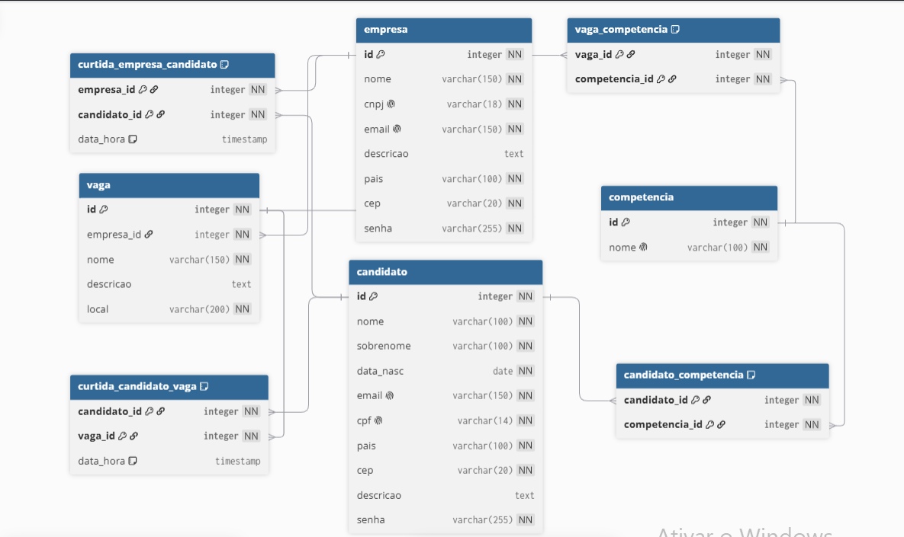

# Linketinder

> Projeto desenvolvido por **Myke William** como parte do desafio da ZG- Acelera ZG).

## Sobre o projeto

O Linketinder é um MVP de sistema de contratação de funcionários, inspirado no conceito do LinkedIn (perfis com competências) combinado com a dinâmica de match do Tinder, unindo candidatos e empresas por meio de competências em comum.

Este projeto foi desenvolvido a pedido do Dr. Antônio Paçoca, empresário e investidor, dono das empresas Arroz-Gostoso e Império do Boliche, com o objetivo de resolver a dificuldade de recrutadores em identificar candidatos com potencial, sem depender de perfis mais "populares" ou com maior destaque em outras plataformas.

O projeto foi implementado em **Groovy**, utilizando conceitos de Programação Orientada a Objetos (POO) e estruturas de dados, seguindo os requisitos definidos para a fase de MVP.

## Funcionalidades

- Cadastro (pré-carregado) de no mínimo 5 candidatos, contendo: nome, e-mail, CPF, idade, estado, CEP, descrição pessoal e lista de competências.
- Cadastro (pré-carregado) de no mínimo 5 empresas, contendo: nome, e-mail corporativo, CNPJ, país, estado, CEP, descrição e lista de competências esperadas dos candidatos.
- Menu interativo via terminal, com as opções:
    - Listar todos os candidatos cadastrados
    - Listar todas as empresas cadastradas
    - Sair do programa

## Arquitetura

O projeto segue uma separação em camadas:

```
com.linketinder
├── model         -> Pessoa (interface), PessoaBase (classe abstrata), Candidato, Empresa
├── repository     -> CandidatoRepository, EmpresaRepository (dados em memória)
├── service        -> CandidatoService, EmpresaService (regras de negócio)
├── menu           -> MenuPrincipal (interação com o usuário via terminal)
└── Main.groovy    -> ponto de entrada da aplicação
```

A classe `Pessoa` define os métodos obrigatórios comuns a candidatos (pessoa física) e empresas (pessoa jurídica). A classe abstrata `PessoaBase` implementa `Pessoa` e concentra os atributos gerais, sendo estendida por `Candidato` e `Empresa`, que adicionam seus atributos específicos.

## Tecnologias utilizadas

- [Groovy](https://groovy-lang.org/) 5.1
- [Gradle](https://gradle.org/) (build tool, com Gradle Wrapper incluso)
- JDK 21

## Como executar o projeto

### Pré-requisitos

- JDK 17 ou superior instalado
- Não é necessário instalar o Gradle nem o Groovy manualmente — o projeto já inclui o Gradle Wrapper (`gradlew`)

### Passos

1. Clone o repositório:
   ```bash
   git clone https://github.com/MykeWill/Linketinder-Project.git
   cd Linketinder-Project
   ```

2. Execute a aplicação:
   ```bash
   ./gradlew run --console=plain
   ```
   > O parâmetro `--console=plain` garante que o menu interativo funcione corretamente lendo a entrada do teclado.

3. No menu exibido, digite o número da opção desejada e pressione Enter:
   ```
   ===== Linketinder =====
   1 - Listar candidatos
   2 - Listar empresas
   0 - Sair
   ========================
   ```

## Próximos passos (requisitos opcionais)

- Implementar cadastro de novos candidatos e empresas via terminal.
- Evoluir a lógica de "match" entre candidatos e empresas com base nas competências em comum.

## Autor

Desenvolvido por **Myke William Silva** durante o Acelera ZG.


------------------------------------------------------------------------------------

# Linketinder – Banco de Dados (Parte 1)

Repositório para a entrega da modelagem e scripts SQL do projeto Linketinder, conforme requisitos da trilha K1-T9.

## Requisitos atendidos

- [x] Pelo menos 4 tabelas: `candidato`, `empresa`, `competencia`, `vaga`.
- [x] Tabelas de relacionamento N:N (`candidato_competencia`, `vaga_competencia`).
- [x] Tabelas de curtidas para controle de match (`curtida_candidato_vaga`, `curtida_empresa_candidato`).
- [x] Scripts SQL com criação do banco, inserts de 5 candidatos e 5 empresas fictícios.
- [x] Queries de exemplo (anônimas, completas e de match).
- [x] MER/DER em imagem (abaixo).
- [x] Indicação da ferramenta de modelagem.

# Modelo DER

  
*Ferramenta: [dbdiagram.io](https://dbdiagram.io/)*

## Scripts SQL

- `sql/01-schema.sql` – criação das tabelas.
- `sql/02-inserts.sql` – inserção de dados fictícios.
- `sql/03-queries.sql` – consultas de exemplo.


---

# Parte 2 – Integração com Banco de Dados (JDBC)

Integração entre a aplicação Groovy e o banco de dados PostgreSQL, utilizando JDBC puro (sem JPA/Hibernate).

## Tecnologias

- Groovy
- Gradle
- PostgreSQL
- JDBC (`org.postgresql:postgresql:42.7.4`)
- JDK 21

## Arquitetura

```
com.linketinder
├── model         -> Pessoa (interface), PessoaBase (abstrata), Candidato, Empresa, Vaga, Competencia
├── dao           -> CandidatoDao, EmpresaDao, VagaDao, CompetenciaDao, ConexaoDB
├── service       -> CandidatoService, EmpresaService, VagaService, CompetenciaService
├── menu          -> MenuPrincipal (interação via terminal)
└── Main.groovy   -> ponto de entrada da aplicação
```

## O que foi implementado

- CRUD de candidato, empresa, vaga e competência.
- Relacionamento N:N entre candidato e competência.
- Relacionamento N:N entre vaga e competência.
- Relacionamento 1:N entre empresa e vaga.
- Tabelas de curtida para controle de match.
- Lógica de anonimato antes do match.

## Scripts SQL

Os scripts estão na pasta `sql/`:

- `sql/01-schema.sql` – criação das tabelas.
- `sql/02-inserts.sql` – inserção de dados fictícios.
- `sql/03-queries.sql` – consultas de exemplo.

## Lógica de Anonimato

Antes do match:
- O candidato vê apenas a descrição, local e competências exigidas da vaga (sem o nome da empresa).
- A empresa vê apenas a descrição pessoal e as competências do candidato (sem nome, e-mail, etc.).

Após o match, as informações completas são reveladas para ambas as partes.


---

# Validação com Regex

Os formulários de cadastro de **candidato** e **empresa** possuem validação de dados com **expressões regulares (Regex)**, implementadas em **TypeScript**, garantindo que apenas dados no formato correto sejam persistidos.

## O que é validado

### Candidato
- Nome, e-mail, CPF, idade, estado, CEP, senha e descrição.

### Empresa
- Nome, e-mail, CNPJ, estado, CEP, senha e descrição.

## Como funciona

- As validações estão centralizadas em `frontend/src/utils/validacoes.ts`.
- Cada função retorna `null` se o dado for válido, ou uma **mensagem de erro** caso contrário.
- A validação é executada na **camada de service** (`candidatoService.ts` e `empresaService.ts`), antes de persistir os dados.
- Se houver erro, a mensagem é exibida para o usuário no formulário.


# Refatoração com Clean Code

Refatorações aplicadas no projeto Linketinder com foco em DRY, funções pequenas, tratamento de erros e testabilidade.

## Wrapper de conexão

Criado o método `ConexaoDB.executar(Closure)` para substituir o bloco repetido de abrir/fechar conexão que existia em todo método de DAO.

## Extração do mapeamento

Criado método privado `mapearX(ResultSet)` em cada DAO (`mapearCandidato`, `mapearEmpresa`, `mapearVaga`, `mapearCompetencia`) para substituir o bloco repetido de montar objetos a partir do banco.

## Tratamento de erros

Criadas exceções customizadas no pacote `exception/`:

- `DadosInvalidosException`
- `RegistroDuplicadoException`
- `RegistroNaoEncontradoException`
- `ErroBancoException`

Criada classe `MensagensErro` para centralizar as mensagens de erro. Os services agora traduzem `SQLException` para essas exceções amigáveis, substituindo as mensagens técnicas que apareciam pro usuário.

## Injeção de dependência

Os services agora recebem seus DAOs pelo construtor, em vez de instanciá-los internamente. A criação dos DAOs foi movida pro `Main.groovy`. Isso permite substituir o DAO por um mock nos testes.

## Testes unitários

Reescritos com Spock, usando `Mock(DAO)` para simular o banco. Testam fluxos de sucesso e de erro. Os testes antigos que usavam `Repository` (classe removida) foram deletados ou reescritos.

---

# Refatoração com SOLID

Refatorações aplicadas no projeto Linketinder com foco nos princípios SOLID.

## Inversão de dependência (D)

Foram criadas interfaces para abstrair o acesso a dados:

- `CandidatoRepository`
- `EmpresaRepository`
- `VagaRepository`
- `CompetenciaRepository`

Os DAOs (`CandidatoDao`, etc.) agora **implementam** essas interfaces. Os services passaram a depender das **interfaces** (abstrações) em vez das classes concretas. A injeção das implementações ocorre no `Main.groovy`.

**Benefício:** o service não sabe se está falando com um DAO PostgreSQL, um mock ou uma futura implementação em memória. Ele só conhece o contrato.

## Segregação de interfaces (I)

Cada interface tem apenas os métodos da sua entidade. Não existe uma interface "gigante" com métodos de candidato, empresa, vaga e competência. Cada contrato é específico e coeso.

## Substituição de Liskov (L)

Qualquer implementação das interfaces pode substituir a outra sem quebrar o código. O `CandidatoDao` pode ser trocado por outra implementação (mock, memória, etc.) sem que o service precise saber.

## Responsabilidade única (S)

As classes já estavam bem separadas por camada:

- **model**: representa os dados
- **repository**: define os contratos de acesso a dados
- **dao**: implementa os contratos usando JDBC
- **service**: orquestra as regras de negócio
- **menu**: interage com o usuário

## Aberto/Fechado (O)

Novas implementações de repository podem ser criadas sem modificar os services existentes. Por exemplo, um `CandidatoDaoMemoria` pode ser adicionado no futuro apenas implementando a interface, sem tocar nos services.

## Testes

Os testes unitários foram atualizados para mockar as **interfaces** (`CandidatoRepository`, etc.) em vez das classes concretas. Isso desacopla os testes da implementação JDBC.

---

# Design Patterns

Padrões de projeto aplicados na criação e gerenciamento de conexões com o banco de dados.

## Factory

Foi criada a interface `ConnectionFactory`, que define o contrato para criação de conexões com o banco. A implementação concreta `PostgresConnectionFactory` cuida da conexão com o PostgreSQL.

**Vantagem:** se um dia for necessário suportar outro banco (MySQL, Oracle, etc), basta criar uma nova implementação da interface (`MySqlConnectionFactory`), sem alterar nenhuma linha dos DAOs. Isso atende ao princípio Aberto/Fechado.

## Singleton

A classe `PostgresConnectionFactory` implementa o padrão Singleton por meio de um construtor privado e do método estático `getInstance()`. Isso garante que exista apenas **uma instância** da fábrica na aplicação inteira.

**Vantagem:** evita criar múltiplas instâncias desnecessárias, e centraliza a criação de conexões em um único ponto de controle.

## Configuração externa

As credenciais do banco (URL, usuário, senha) foram movidas para o arquivo `src/main/resources/database.properties`, lido pela classe `DatabaseConfig`.

**Vantagem:** trocar de banco ou ambiente não exige recompilar o código — só alterar o arquivo de configuração.

## Refatoração do ConexaoDB

A classe `ConexaoDB` foi refatorada para usar a `ConnectionFactory` em vez de se acoplar diretamente ao PostgreSQL. O método `executar(Closure)` continua idêntico, então **nenhum DAO precisou ser alterado**.

**Vantagem:** o acoplamento com o PostgreSQL foi movido para a implementação da fábrica. O resto do código não conhece o banco.

---

# Refatoração com MVC

O projeto foi reestruturado para seguir o padrão MVC (Model-View-Controller), separando claramente as responsabilidades de cada camada.

## Estrutura das camadas

- **Model**: entidades do domínio (`Candidato`, `Empresa`, `Vaga`, `Competencia`).
- **View**: interface de interação com o usuário (`MenuPrincipal`, `CandidatoView`, `EmpresaView`).
- **Controller**: porta de entrada para cada operação (`CandidatoController`, `EmpresaController`, `VagaController`, `CompetenciaController`).

Além do MVC clássico, o projeto mantém as camadas de **Service** (regras de negócio) e **DAO** (acesso ao banco), reforçando a separação de responsabilidades.

## O que mudou

### Separação das Views

O `MenuPrincipal` antes concentrava toda a lógica de interação com o usuário (exibir menu, coletar dados de candidato, coletar dados de empresa, tratar erros). Isso violava o princípio da responsabilidade única.

A interação foi dividida em views específicas:

- `MenuPrincipal` — apenas exibe o menu e roteia para a view correta.
- `CandidatoView` — cuida da interação relacionada a candidatos (listar e cadastrar).
- `EmpresaView` — cuida da interação relacionada a empresas (listar e cadastrar).

### Criação da camada Controller

Antes, as views chamavam os **services** diretamente. Agora existe uma camada intermediária de **controllers**:

- As views chamam os controllers.
- Os controllers chamam os services.
- Os services chamam os DAOs.
- Os DAOs acessam o banco.

Isso cria uma cadeia de dependência clara e unidirecional, facilitando a evolução para frameworks (Spring, por exemplo) no futuro.

### Fluxo de uma requisição

Exemplo do cadastro de um candidato:

1. Usuário interage com o `CandidatoView` (View).
2. `CandidatoView` chama `CandidatoController.cadastrarCandidatoController()`.
3. `CandidatoController` chama `CandidatoService.cadastrarCandidato()`.
4. `CandidatoService` chama `CandidatoDao.inserirCandidato()`.
5. `CandidatoDao` grava no banco e devolve o ID.
6. A resposta sobe a cadeia de volta até a View.

## Benefícios

- **Separação clara de responsabilidades**: cada classe tem um papel bem definido.
- **Testabilidade**: cada camada pode ser testada isoladamente.
- **Baixo acoplamento**: as views não conhecem os services; os controllers não conhecem os DAOs diretamente.
- **Preparado para frameworks**: essa estrutura é a base do que frameworks MVC (Spring MVC, por exemplo) esperam.

---

# API REST

O backend foi estendido com endpoints REST sem uso de frameworks. A comunicação entre cliente e servidor usa JSON sobre HTTP.

## Recursos utilizados

- `com.sun.net.httpserver.HttpServer` — servidor HTTP embutido no JDK. Escolhido por não exigir framework nem dependência externa.
- `com.sun.net.httpserver.HttpHandler` — interface para tratar requisições. Cada recurso tem seu handler.
- `groovy.json.JsonSlurper` — converte JSON em objetos Groovy (parse).
- `groovy.json.JsonOutput` — converte objetos Groovy em JSON (serialize).
- `Thread` — o servidor roda em uma thread separada, permitindo que o menu console continue funcionando em paralelo.

## Servidor HTTP

A classe `ServidorHttp` sobe o `HttpServer` na porta **8080** e registra três rotas, cada uma com seu handler correspondente:

- `/candidatos` → `CandidatoHandler`
- `/empresas` → `EmpresaHandler`
- `/vagas` → `VagaHandler`

Cada handler implementa `HttpHandler` e recebe o controller do seu recurso por injeção de dependência. O handler não contém regra de negócio: apenas interpreta a requisição HTTP, converte JSON em objeto de domínio e delega ao controller.

O servidor roda em uma thread separada da thread principal, permitindo que o menu console continue funcionando simultaneamente.

## Endpoints disponíveis

| Método | Rota         | Descrição                  |
|--------|--------------|----------------------------|
| POST   | /candidatos  | Cadastra um candidato      |
| GET    | /candidatos  | Lista todos os candidatos  |
| POST   | /empresas    | Cadastra uma empresa       |
| GET    | /empresas    | Lista todas as empresas    |
| POST   | /vagas       | Cadastra uma vaga          |
| GET    | /vagas       | Lista todas as vagas       |

## Fluxo de uma requisição

```
Cliente (Postman/curl)
  ↓ HTTP
ServidorHttp (recebe)
  ↓ roteia
CandidatoHandler (parseia JSON, monta objeto)
  ↓ chama
CandidatoController (já existia do MVC)
  ↓ chama
CandidatoService (já existia)
  ↓ chama
CandidatoDao (já existia)
  ↓ JDBC
PostgreSQL
```

Os controllers, services e DAOs foram reaproveitados da refatoração MVC. A única camada nova é a dos handlers, que adaptam HTTP para as chamadas já existentes.

---
